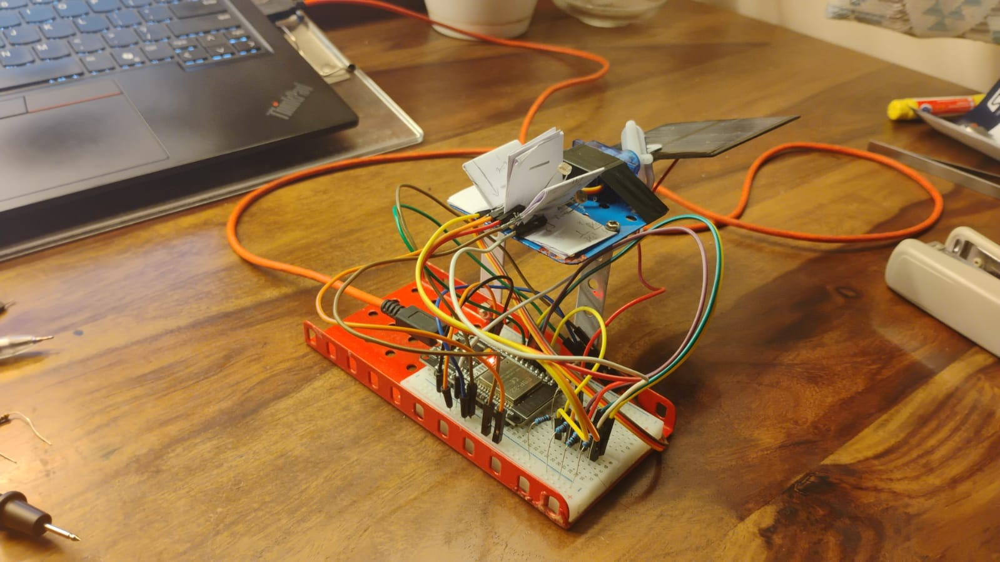
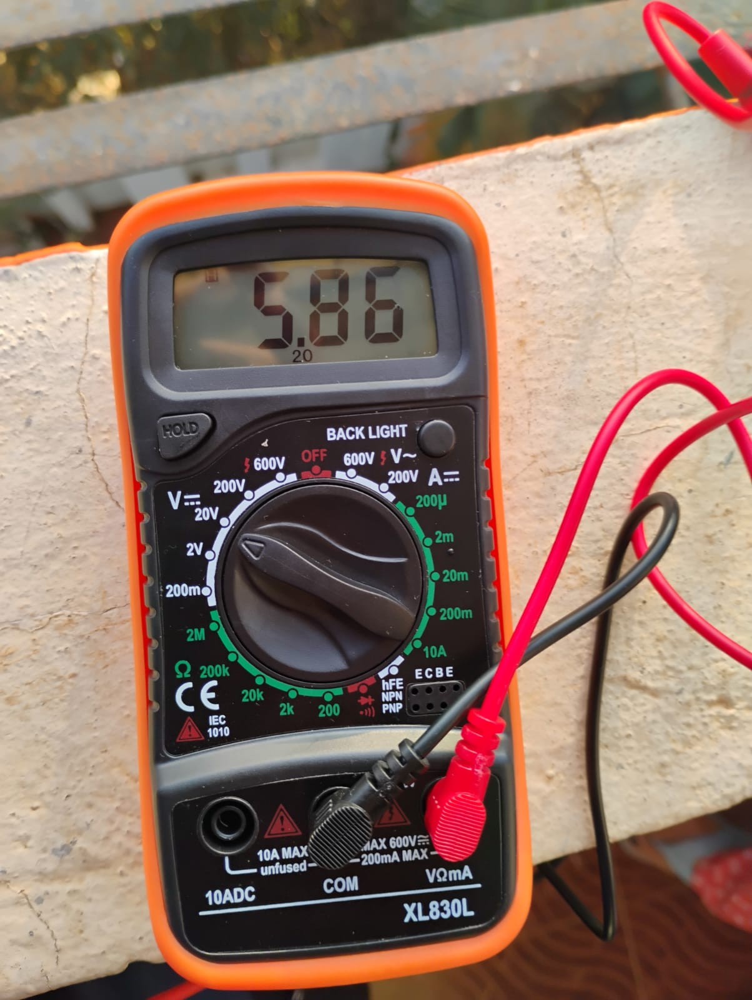
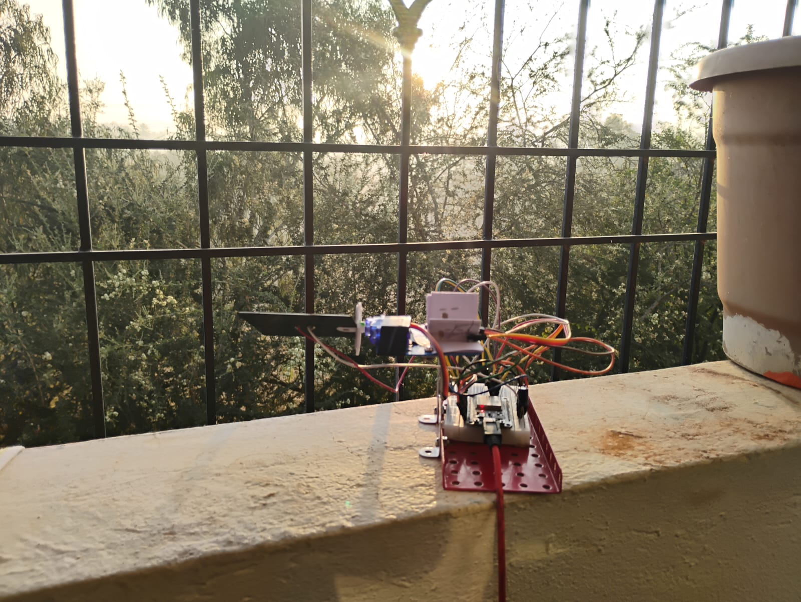
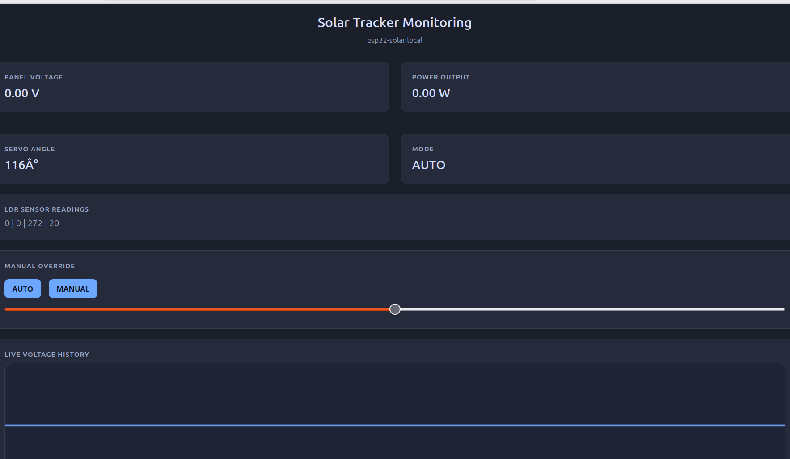
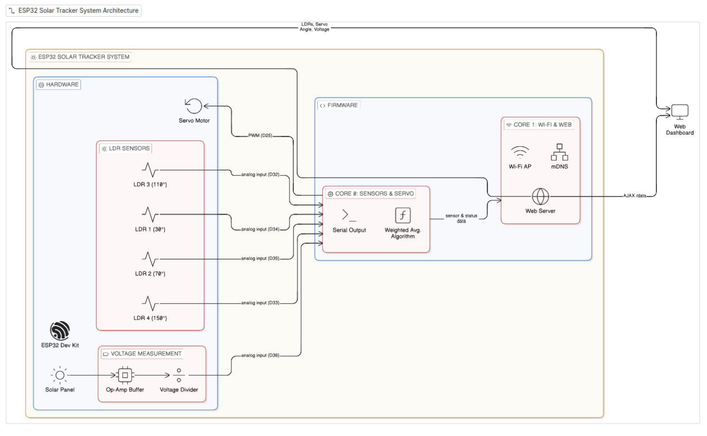

# LDR Based Weighted Algorithm Solar Tracker with WiFi Integration

### ESP32-WROOM-32 · Dual-Core FreeRTOS · PlatformIO · GNU GPL v2.0

---

## Abstract

This project presents the design and implementation of a single-axis solar tracking system using the **ESP32-WROOM-32** microcontroller platform. The system integrates four Light Dependent Resistors (LDRs), servo-based actuation, analog voltage sensing, and a WiFi-enabled embedded dashboard.

Unlike conventional threshold-based tracking approaches, this implementation employs a **continuous weighted-average control algorithm**, enabling proportional orientation of the solar panel with reduced mechanical oscillation and improved stability.

The architecture combines deterministic real-time control (Core 0) with concurrent network services (Core 1) under **FreeRTOS**, demonstrating practical integration of embedded control systems with IoT capabilities.

---

---

## 1. Hardware Architecture

The system is structured into four primary layers:

| Layer      | Description                                   |
| ---------- | --------------------------------------------- |
| Sensing    | Four LDRs positioned at fixed angular offsets |
| Processing | ESP32-WROOM-32 running dual-core FreeRTOS     |
| Actuation  | Servo motor (0°–180° rotation)                |
| Monitoring | Embedded HTTP server with mDNS resolution     |

---

### 1.1 FreeRTOS Core Allocation

| Core   | Function                                                                        |
| ------ | ------------------------------------------------------------------------------- |
| Core 0 | Sensor acquisition, weighted computation, servo smoothing, ADC voltage sampling |
| Core 1 | WiFi SoftAP, HTTP server, mDNS resolution, REST endpoints                       |

This separation ensures networking overhead does not interfere with real-time tracking stability.

---

## 📷 Circuit Diagram


---

## 📷 Prototype Assembly



---

## 📷 Multimeter Verification



---

## 📷 Outdoor Testing



---

## 2. Voltage Measurement Model

The panel voltage is sampled using a voltage divider:

* External resistor: **4.5 kΩ**
* Internal pull-up resistor: **45 kΩ**

Approximate scaling:

$$
\frac{45k}{4.5k} \approx 10 \Rightarrow \text{Effective Scaling} \approx 11:1
$$

Voltage conversion:

$$
V_{\text{panel}} = \left(\frac{ADC}{4095}\right) \times 3.3 \times 11
$$

Where:

* $ADC$ = 12-bit analog reading
* 3.3V = ADC reference
* 11 = scaling constant

---

## 3. Weighted Tracking Algorithm

### 3.1 Mathematical Model

Let:

* $w_i$ = normalized light intensity from sensor $i$
* $\theta_i$ = physical angle of sensor $i$

Target servo angle:

$$
\theta = \frac{\sum_{i=1}^{4} w_i \theta_i}{\sum_{i=1}^{4} w_i}
$$

This formulation provides proportional alignment with maximum irradiance.

---

### 3.2 Servo Motion Stabilization

```cpp
if(currentServoPos < servoAngle) currentServoPos++;
else if(currentServoPos > servoAngle) currentServoPos--;
```

This incremental interpolation prevents oscillatory jitter and reduces mechanical stress.

---

## 4. Embedded Web Interface

Accessed via:

```
http://esp32-solar.local
```

### REST Endpoints

| Endpoint   | Description            |
| ---------- | ---------------------- |
| `/data`    | Live telemetry (JSON)  |
| `/history` | Voltage history        |
| `/control` | Manual / Auto override |

---

## 📷 Dashboard Interface



---
metrics:

[metrics](metrics.md)


for contact:
1) email: blue.sky1911@outlook.com (general queries)# PART II — Performance Evaluation & Engineering Analysis

---

## 5. Performance Comparison

The weighted tracking algorithm was evaluated against a static fixed-panel configuration.

| Parameter                  | Static Panel | Weighted Tracker |
| -------------------------- | ------------ | ---------------- |
| Morning Irradiance Capture | Low          | Improved         |
| Midday Stability           | Moderate     | High             |
| Late-Afternoon Efficiency  | Low          | Improved         |
| Servo Oscillation          | None         | Minimal          |
| Angular Accuracy           | Fixed        | Adaptive         |
| Energy Exposure Duration   | Limited      | Extended         |

The weighted algorithm demonstrated improved exposure duration and smoother mechanical behavior relative to static mounting.

---

## 📷 System Flowchart



---

## 6. Engineering Observations

1. Weighted averaging eliminates threshold-induced oscillation.
2. Servo smoothing significantly reduces mechanical stress.
3. Dual-core separation enhances determinism.
4. mDNS simplifies deployment without IP discovery.
5. LDR-based sensing is cost-effective but sensitive to diffuse light.

---

## 7. Limitations

* Single-axis tracking only
* No seasonal declination compensation
* Power estimation assumes constant current
* No integrated MPPT

---

## 8. Future Work

* Dual-axis tracking
* INA219 current sensing
* MPPT integration
* SD card logging
* MQTT telemetry
* Cloud-based monitoring

---

## 9. Key Technical Concepts Demonstrated

* Analog signal conditioning
* Voltage divider scaling
* ADC calibration
* PWM servo control
* Closed-loop control systems
* Weighted average computation
* Dual-core FreeRTOS scheduling
* Embedded HTTP server implementation
* mDNS networking

---

## Platform & License

| Attribute            | Specification                   |
| -------------------- | ------------------------------- |
| Microcontroller      | ESP32-WROOM-32                  |
| Development Platform | PlatformIO                      |
| RTOS                 | FreeRTOS (Dual-Core)            |
| License              | GNU General Public License v2.0 |

---

for referrence to metrics (estimated + very rough idea):
[metrics](metrics.md)

> [!NOTE]
> DO not refer to this markdown for actual performances, it is just a reserved space for future work
> if required, please contact me through email to send actual performance metrics. will conduct it on demand